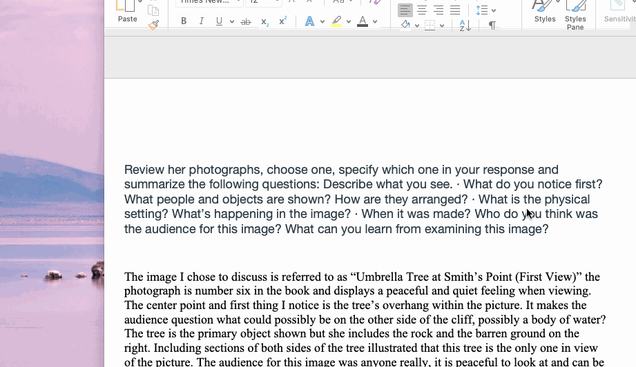

# Responsive-Portfolio

# Introduction

I built a portfolio for future project to be added. 

## Technologies Used
 - HTML
 - CSS
 - Git
 - Github

 ## Summary

 I built a resposive portfolio using media queries at breakpoint 980px, 768px and 640px. 
 There are three sections to the portfolio including and About Me, Portfolio and Contact page. All pages are easily accessible the links in the header. After writing the HTML, I used CSS to style the website to look identical to the instructions. 

 
